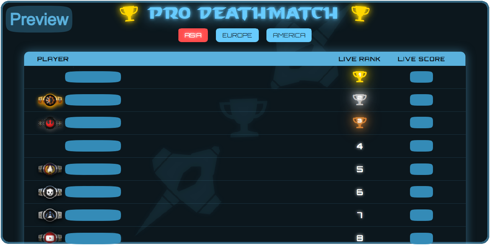

# PDM Leaderboard

The **PDM Leaderboard** is a real-time ranking system for the "Pro Deathmatch" mod in [Starblast.io](https://starblast.io). This platform provides up-to-date player standings across multiple regions, allowing competitors to track their progress and engage in high-level gameplay.

## Features
- Live player rankings
- Regional leaderboards (Asia, Europe, America)
- Smooth and responsive UI
- Regular updates for accurate standings

## Live Website
Check out the leaderboard here: [PDM Leaderboard](https://modraxiss.github.io/PDM-Leaderboard/)

## Contribution
Feel free to contribute by submitting issues or pull requests. For inquiries, contact **Modraxis (aka Basit) on Discord: m.basit**.

## License
This project is open-source and available under the MIT License.
